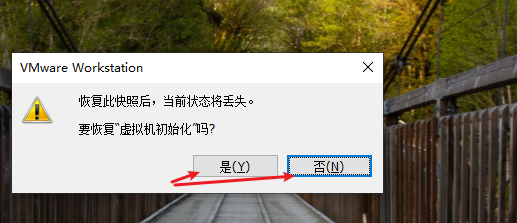
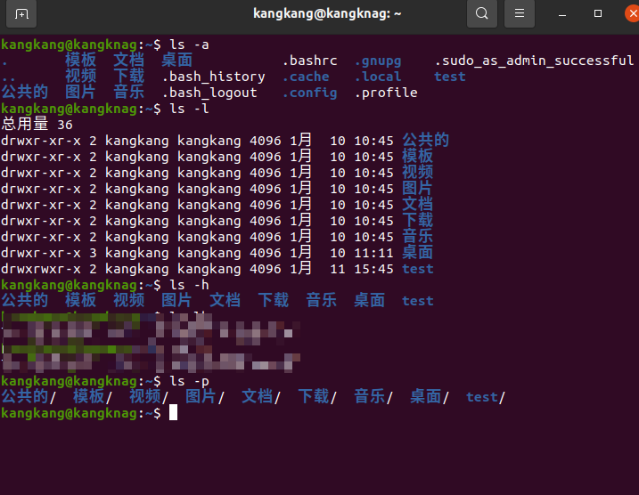

# linux-01

## 系统快照
> 快照可以记录虚拟机当前所有的状态，用于在操作系统发生故障后将系统恢复至未发生故障时的状态

### 拍摄快照


### 快照管理


### 恢复快照




## 文件和目录

### 单用户操作系统和多用户操作系统
单用户操作系统：一台计算机同一时间只能由一个用户使用，一个用户独享系统内全部硬件资源和软件资源（windows XP系统之前）
多用户操作系统：一台计算机同一时间可以由多个用户使用，多个用户共同享用系统的全部硬件资源和软件资源（Linux）

### windows系统和Linux系统的区别

### windows系统
在`windows`下， 打开计算机，可与看到一个又一个的驱动盘符，每一个驱动器都有自己的跟目录结构


### Linux系统
在`Linux`下，我们看不到驱动器盘符，只能看到文件夹（目录）


`Linux`没有盘符的概念，只有`一个根目录`，所有的文件都在它的下面


### Linux 主要目录速查表

* /：根目录，**一般根目录下只存放目录**，在 linux 下有且只有一个根目录，所有的东西都是从这里开始
  * 当在终端里输入 `/home`，其实是在告诉电脑，先从 `/`（根目录）开始，再进入到 `home` 目录
* /bin、/usr/bin：可执行二进制文件的目录，如常用的命令 ls、tar、mv、cat 等
* /boot：放置 linux 系统启动时用到的一些文件，如 linux 的内核文件：`/boot/vmlinuz`，系统引导管理器：`/boot/grub`
* /dev：存放linux系统下的设备文件，访问该目录下某个文件，相当于访问某个设备，常用的是挂载光驱`mount /dev/cdrom /mnt`
* /etc：系统配置文件存放的目录，不建议在此目录下存放可执行文件，重要的配置文件有 
  * /etc/inittab
  * /etc/fstab
  * /etc/init.d
  * /etc/X11
  * /etc/sysconfig
  * /etc/xinetd.d
* /home：系统默认的用户家目录，新增用户账号时，用户的家目录都存放在此目录下
  * `~` 表示当前用户的家目录
  * `~edu` 表示用户 `edu` 的家目录
* /lib、/usr/lib、/usr/local/lib：系统使用的函数库的目录，程序在执行过程中，需要调用一些额外的参数时需要函数库的协助
* /lost+fount：系统异常产生错误时，会将一些遗失的片段放置于此目录下
* /mnt: /media：光盘默认挂载点，通常光盘挂载于 /mnt/cdrom 下，也不一定，可以选择任意位置进行挂载
* /opt：给主机额外安装软件所摆放的目录
* /proc：此目录的数据都在内存中，如系统核心，外部设备，网络状态，由于数据都存放于内存中，所以不占用磁盘空间，比较重要的文件有：/proc/cpuinfo、/proc/interrupts、/proc/dma、/proc/ioports、/proc/net/* 等
* /root：系统管理员root的家目录
* /sbin、/usr/sbin、/usr/local/sbin：放置系统管理员使用的可执行命令，如 fdisk、shutdown、mount 等。与 /bin 不同的是，这几个目录是给系统管理员 root 使用的命令，一般用户只能"查看"而不能设置和使用
* /tmp：一般用户或正在执行的程序临时存放文件的目录，任何人都可以访问，重要数据不可放置在此目录下
* /srv：服务启动之后需要访问的数据目录，如 www 服务需要访问的网页数据存放在 /srv/www 内
* /usr：应用程序存放目录
  * /usr/bin：存放应用程序
  * /usr/share：存放共享数据
  * /usr/lib：存放不能直接运行的，却是许多程序运行所必需的一些函数库文件
  * /usr/local：存放软件升级包
  * /usr/share/doc：系统说明文件存放目录
  * /usr/share/man：程序说明文件存放目录
* /var：放置系统执行过程中经常变化的文件
  * /var/log：随时更改的日志文件 
  * /var/spool/mail：邮件存放的目录
  * /var/run：程序或服务启动后，其 PID 存放在该目录下

## 终端命令

### 为什么学习终端命令
在真的的工作场景中，Linux服务器是不会安装图形界面的，维护人员都是通过远程链接的方式链接到服务器系统，使用命令的方式对系统进行维护，所以我们要掌握一些Linux系统的错做命令，如**磁盘操作**、**文件存取**、**目录操作**、**进程管理**、**文件权限**设定等

Linux发行的版本命令大概由200多个，但是常用的命令只有10多个而已，对于常用命令不需要死记硬背，用的多了自然就记住了，不要尝试一次学会所有的命令，有些命令是非常不常用的，临时遇到临时百度就可以

| 序号 | 命令           | 对应英文             | 作用                   | 示例                   |
| ---- | -------------- | -------------------- | ---------------------- | ---------------------- |
| 01   | ls             | list                 | 查看当前文件夹下的内容 | ls （在任何目录下）         |
| 02   | pwd            | print work directory | 查看当前所在工作目录   | pwd （在任何目录下）         |
| 03   | cd [目录名]    | change directory     | 切换目录               | cd.. cd /                  |
| 04   | touch [文件名] | touch                | 新建文件               | touch aa.txt               |
| 05   | mkdir [目录名] | make directory       | 创建目录               | mkdir test                 |
| 06   | rm [文件名]    | remove               | 删除指定名称的文件     | rm aa.txt                   |
| 07   | clear          | clear                | 清屏                   | clear                     |


`Ctrl`+`Shift`+`+` 放大终端控制台字体
`Carl`+`-` 缩小终端控制台字体

### 终端命令格式
```bash
command [-options] [parameter]
```
`command`: 命令名称，相应功能的英文单词或单词缩写
`-optiomns`: 选项，可用来对命令进行控制，也可以省略
`parameter`: 传给命令的参数，可以是零个、一个、或者多个
`[]` 代表可选

### 查看命令帮助信息
- 查询命令的简要帮助信息
```bash
command --help
```
- 查询命令的详细帮助信息
```bash
man command
```
`man` 是 **manual** 的缩写, 是 Linux 提供的一个**手册**, 包含了绝大部分命令、函数的详细使用说明

| 操作键    | 功能                       |
| --------- | -------------------------- |
| 空格键、f | 显示手册的下一页           |
| Enter 键  | 按一次手册内容向下滚动一行 |
| b         | 显示手册的上一页           |
| q         | 退出手册                   |

## 文件和目录常用命令

### 查看目录内容

- ls命令说明
ls是list的简写，其功能为列出当前工作目录中的内容 是Linux用户常用的命令之一，类似于DOC下的`dir`命令

- 常用选项
| 参数 | 含义                                             |
| ---- | ------------------------------------------------ |
| -a   | 显示当前工作目录下的所有目录和文件, 包括隐藏文件 |
| -l   | 以列表方式显示文件的详细信息                     |
| -h   | 和 -l 配合使用以人性化的方式显示文件大小         |
| -p   | 对目录附加"/"作为指示符号                        |


