# MySQL-01

## 为什么学习MySQL
1. 因为99%的网站都需要数据库的支持，44%的网站使用的都是MySQL数据库（市场占有率第一）
2. MySQL免费
3. sql语句--> 操作95%的数据库类型（大部分的数据库都支持sql语句）

## 数据库的概念
数据库（Database）是按照 **数据库结构来组织**、**存储和管理数据库** 的建立在计算机存储设备上的仓库
数据库：存储数据的仓库

## 数据库分类
### 网络数据库
网络数据库是指把数据库技术引入到计算机网络系统中，借助于网络技术将存储于数据库中的大量信息及时发布出去；而计算机网络借助于成熟的数据库技术对网络中的各种数据进行有效管理，并实现用户与网络中的数据库进行实时动态数据交互。

### 层级数据库
层次结构模型实质上是一种有根结点的定向有序树(在数学中"树"被定义为一个无回的连通图)。

### 关系数据库
关系数据库，是建立在关系模型基础上的数据库，借助于集合代数等数学概念和方法来处理数据库中的数据。

### 数据库的另外一种区分方式：基于存储介质

存储介质分为两种：磁盘和内存

关系型数据库：存储在磁盘中
非关系型数据库：存储在内存中

## 关系数据库
关系数据库，是建立在关系模型基础上的数据库，借助于集合代数等数学概念和方法来处理数据库中的数据。现实世界中的各种实体以及实体之间的各种联系均用关系模型来表示。关系模型是由埃德加·科德于1970年首先提出的，并配合“科德十二定律”。现如今虽然对此模型有一些批评意见，但它还是数据存储的传统标准。关系模型由**关系数据结构**、**关系操作集合**、**关系完整性约束**三部分组成。

|姓名     |	年龄	    | 身高	  | 体重     |
| :-----: | :------: | :-----: | :------: |
|张三	    |30	        | 187	   | 70       |
|李四	    |40		      |        |          |

- 关系数据结构（表格）：指的数据以什么方式来存储，是一种二维表的形式存储
本质：二维表

- 关系操作集合（sql语句）：如何来关联和管理对应的存储数据，SQL指令
获取张三的年纪：已知条件为姓名
Select 年龄 from 二维表 where 姓名 = 张三；

- 关系完整性约束：数据内部有对应的关联关系，以及数据与数据之间也有对应的关联关系

1. 表内约束：对应的具体列只能放对应的数据（不能乱放）
2. 表间约束：自然界各实体都是有着对应的关联关系（外键）

关系数据库

### 典型的关系型数据库
Oracle、DB2、Microsoft SQL Server、Microsoft Access、MySQL、SQLite

小型关系型数据库：Microsoft Access，SQLite
中型关系型数据库：SQL Server，Mysql
大型关系型数据库：Oracle，DB2

## sql介绍

### sql基本介绍
结构化查询语言(Structured Query Language)简称SQL，是一种特殊目的的编程语言，是一种数据库查询和程序设计语言，用于存取数据以及查询.更新和管理关系数据库系统；同时也是数据库脚本文件的扩展名。

SQL就是专门为关系型数据库而设计出来的。

1.	数据查询语言（DQL:Data Query Language）：
其语句，也称为“数据检索语句”，用以从表中获得数据，确定数据怎样在应用程序给出。保留字SELECT是DQL（也是所有SQL）用得最多的动词，其他DQL常用的保留字有WHERE，ORDER BY，GROUP BY和HAVING。这些DQL保留字常与其他类型的SQL语句一起使用。

专门用于查询数据：代表指令为select/show 

2.	数据操作语言（DML：Data Manipulation Language）：
其语句包括动词INSERT，UPDATE和DELETE。它们分别用于添加，修改和删除表中的行。也称为动作查询语言。

专门用于写数据：代表指令为insert，update和delete

3.	事务处理语言（TP/cL）：
它的语句能确保被DML语句影响的表的所有行及时得以更新。TPL语句包括BEGIN TRANSACTION，COMMIT和ROLLBACK。（不是所有的关系型数据库都提供事务安全处理）

专门用于事务安全处理：transaction

4.	数据控制语言（DCL）：
它的语句通过GRANT或REVOKE获得许可，确定单个用户和用户组对数据库对象的访问。某些RDBMS可用GRANT或REVOKE控制对表单个列的访问。

专门用于权限管理：代表指令为grant和revoke

5.	数据定义语言（DDL）：
其语句包括动词CREATE和DROP。在数据库中创建新表或删除表（CREAT TABLE 或 DROP TABLE）；为表加入索引等。DDL包括许多与人数据库目录中获得数据有关的保留字。它也是动作查询的一部分。

专门用于结构管理：代表指令create和drop（alter）

## MySQL基本介绍
MySQL是一个**关系型数据库管理系统**，由瑞典MySQL AB公司开发，目前属于`Oracle` 旗下的产品。MySQL是最流行的关系型数据库管理系统之一，在WEB应用方面，MySQL是最好的RDBMS（Relational Database Management System 关系数据库管理系统）应用软件。

AB公司被Sun公司收购 -->Oracle又收购了Sun公司

1. MySQL是一种开源免费的数据库产品
2. MySQL对node的支持是最好的，对Java的支持也很好
MySQL中用到的操作指令就是SQL指令

### MySQL服务的启动与停止
Mysql是一种C/S结构：客户端和服务端

服务端对应的软件：Mysqld.exe


#### windows系统 `cmd` 控制器开启/停止服务
```bash
# 查看当前mysql安装版本
mysql --version

# 停止MySQL服务
net stop mysql

# 启动MySQL服务
net start mysql
```
> 注意使用管理员身份运行
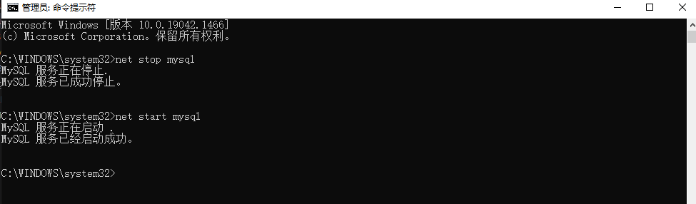


#### windows系统 `服务` 开启/关闭系统

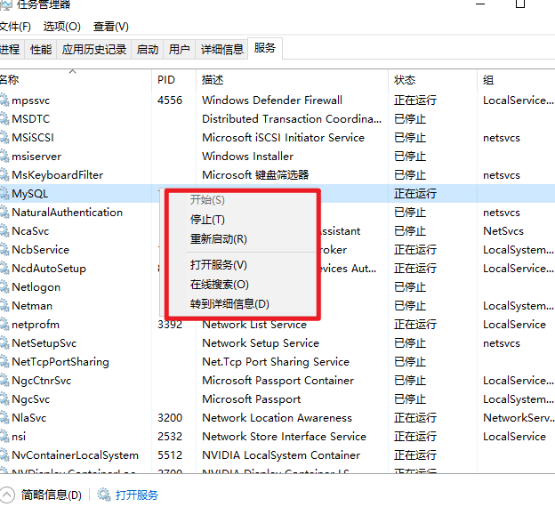

### 登陆/退出MySQL系统
```bash
# 登录
mysql.exe/mysql -h主机地址 -P端口 -u用户名 -p密码
# 退出
exit;
quit;
/c + ;

CTRL+C
```

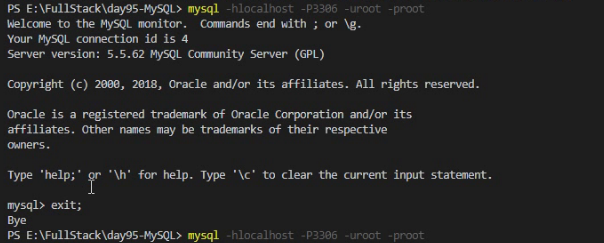

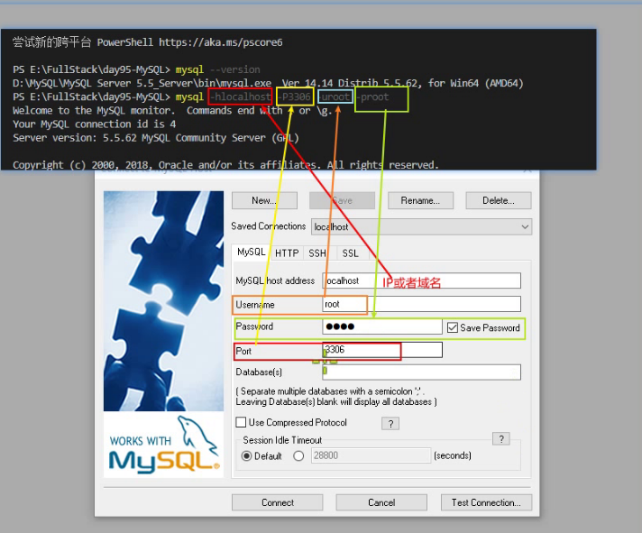

### MySQL 服务端架构
MySQL服务端架构由以下几点构成
1. 数据库管理系统（最外层）： DBMS 抓门管理服务器端的所有内容
2. 数据库（第二层）：DB 专门用于存储具体实体的数据
3. 二维数据表（第三层）：Table 专门用于存储具体的数据
4. 字段（第四层）：Field 具体存储某种类型的数据（实际存储单元）
数据库中常用的几个关键字
Row：行
Column：列（field）

## 数据库的基本操作

> 以下操作以连接数据库为前提下操作
```bash
mysql -uroot -p
****
```
### 数据库一级操作
#### 查看当前所拥有的数据建库

- 语法
```bash
show databases;
```

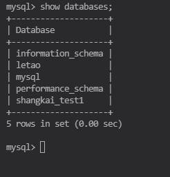

#### 使用（进入）数据库
- 语法
```bash
use [当前存在的数据库名]
use letao
```

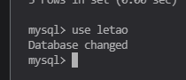


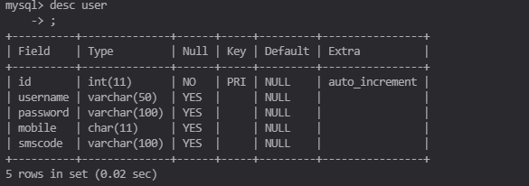
#### 创建数据库
- 语法：
```bash
create database [数据库名]
create database [数据库名] charset [字符集]
create database test charset utf8
```
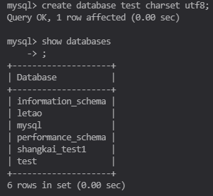

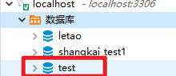

#### 删除数据库
- 语法：
```bash
drop database [数据库名]
drop database [数据库名] 
drop database test
```

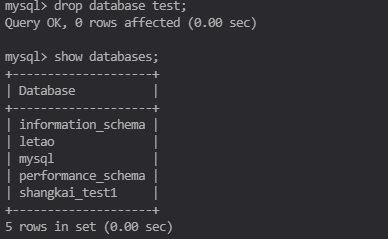

#### 修改数据库
修改`字符集合`和`校对集`
```bash character set
alert database [数据库名] character set [字符集]
alert database test character set utf8
```
- 是否可以修改数据库名称？
5.1 版本之前是可以的 rename命令 
5.5 之后不可以修改 只能删除之后再创建

### 数据表一级操作
#### 显示当前数据库中所有表
```bash
show tables
```

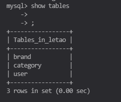

#### 查看当前数据库中其中一个表的结构
```bash
desc [表名]
desc user
```