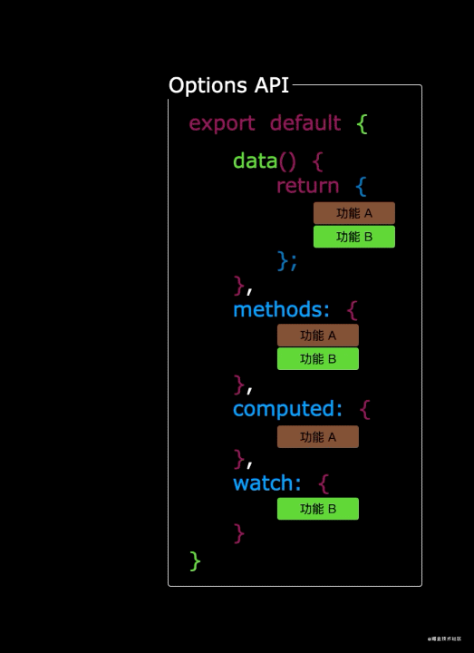
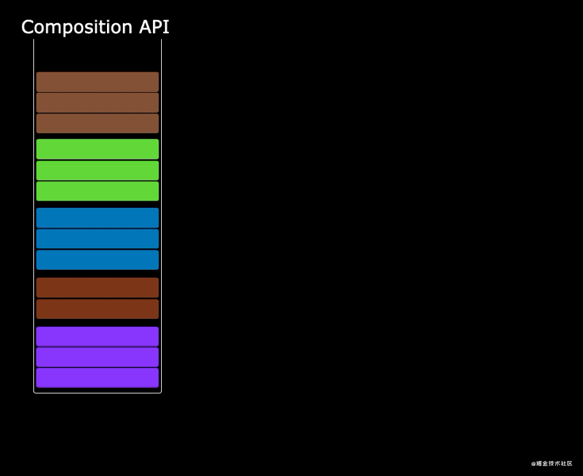

# day-01

## 为什么学习Vue3
> 目标： 了解学习Vue3的重要性

- Vue3运行性能大幅度提升 速度是vue2的1.5倍左右
- Vue3 支持tree shaking， 可以进行按需编译， 编译后文件体积比vue2小
- Vue3 组合式API 使应用中的代码更聚合 使组件间公共逻辑的抽取更容易
- Vue3 对TypeScrite的支持更友好，对大型前端应用的支持更加游刃有余
- vue3 中提供了更加先进的功能 如如teleport、suspense等
- Vue是目前国内前端使用者最多的框架 Vue是将来的必然趋势

[Vue3 官方中文文档](https://v3.cn.vuejs.org/)

## 使用vite创建项目
> 使用vite构建工具创建Vue应用 [Vite官方](https://cn.vitejs.dev/)

Vite是一款新型的前端构造工具 核心卖点就是快 启用速度快 编译速度快
1. 创建项目
```shell
npm init vite-app vue-tutorial
# or
npx create-vite-app vue-tutorial
```

2. 切换至应用根目录
```shell
cd vue-tutorial
```

3. 下载依赖
```shell
npm install 
# or
npm i

# or
yarn
```
4. 启动项目 
```
npm run dev
# yarn dev
```

5. 访问应用
```
localhost: 3000
```

## 组合式API的优势
在选项式API中 他将数据和逻辑进行了分离 所有不相关的数据被放置在了一起 所有不相关的逻辑被放在了一起。 随着应用规模的增加项目也变得难以维护 



在组合式API中它将同一个功能的逻辑和数据放置在了一起 使同一个功能代码更加聚合


同一个功能的代码被抽取到单独的文件中 使代码更加容易维护




## 组合式API入口

> 掌握`setup`的基本使用


### setUp中的this指向
- `setup` 是一个新的组件选项 作为组件中使用组合式API的入口函数
- `setup` 函数在任何声明周期函数执行之前（包括beforeCreate） 且函数内部`this`的值为undefined 所以`this`它不能绑定组件实例对象
`app.vue`
```vue
<template>
  <div>
    <h1>Vue test</h1>
  </div>
</template>
<script>
export default {
  setup() {
    console.log(this);  // undefined
  },
  beforeCreate() {
    console.log("beforeCreate")  // beforeCreate 
  },
};
</script>
```

### setup中的响应式数据对象
`app.js`
```vue
<template>
  <div>
    <h1>Vue test{{name}}</h1>
  </div>
</template>
<script>
export default {
  setup() {
    console.log(this);  // undefined
    let name = "张三";
    return {
      name
    }
  },
  beforeCreate() {
    console.log("beforeCreate")  // beforeCreate 
    console.log(this.name)
  },
};
</script>
```

**虽然在setup中返回了变量`name`**， 但是他不是响应式数据,name虽然被成功重新赋值 但是页面中的name并没有变化
```vue
<template>
  <div>
    <h1 @click="handleClick">Vue test{{name}}</h1>
  </div>
</template>

<script>
export default {
  setup() {
    console.log(this);  // undefined
    let name = "张三";
    const handleClick = () => {
      name = "李四"
      console.log(name) // 李四
    }
    return {
      name,
      handleClick
    }
  },
  beforeCreate() {
    console.log("beforeCreate")  // beforeCreate 
    console.log(this.name)
  },
};
</script>
```

### 响应式组件状态——ref
> 掌握使用ref方法创建 修改响应式数据的方式

- 使用ref创建的响应式数据 即会及时的响应数据变化更新视图
`components/Ref.vue`
```vue
<template>
  <div>
    <h1>响应式组件状态 ref</h1>
    <strong>{{name}}</strong>
  </div>
</template>

<script>import { ref } from "vue"

export default {
  setup () {
    const name = ref("张三")
    return {
      name
    }
  }
  
}
</script>
```

- 响应数据变化更新视图
`components/Ref.vue`
```vue
<template>
  <div>
    <h1>响应式组件状态 ref</h1>
    <strong>{{name}}</strong>
    <button @click="handleClick">替换名字</button>
  </div>
</template>

<script>import { ref } from "vue"

export default {
  setup () {
    const name = ref("张三")
    const handleClick = () => {
      name.value = "李四"
    }
    return {
      name,
      handleClick
    }
  }
  
}
</script>
```

- 使用ref创建引用数据类型的响应式数据
```vue
<template>
  <div>
    <h1>响应式组件状态 ref</h1>
    <p>Ref——普通数据类型</p>
    <strong>{{name}}</strong>

    <p>Ref——引用数据类型</p>
    <strong>{{person.name}} {{person.age}}岁</strong>
    <button @click="handleClick">替换名字</button>
  </div>
</template>

<script>import { ref } from "vue"

export default {
  setup () {
    
    //#region  ref创建普通数据类型响应式数据
    const name = ref("张三")
    const handleClick = () => {
      name.value = "李四"
      person.value.name = "kangknag"
    }
    //#endregion
    
    //#region  reactive创建引用数据类型响应式数据
    const person = ref({
      name: "王五",
      age: 20
    })
    //#endregion
    
    return {
      name,
      person,
      handleClick
    }
  }
  
}
</script>
```

```
注意：
  ref创建的响应式数据 无论是普通数据类型还是引用数据类型 都需要使用 变量名.value才能隐形修改 否则直接进行赋值将不再是响应式数据
  当使用ref创建引用数据类型的响应式数据时要使用 变量名.value.属性（person.value.name） 的方式修改数据
```

### 响应式组件状态——Reactive
> 掌握使用reactive 函数创建响应式数据的方式 掌握ref和reactive的区别
- [ ] 讲解 reactive 函数的作用
- [ ] 讲解如何使用 reactive 函数创建基于引用数据类型的响应式数据
- [ ] 讲解 reactive 函数在使用时的注意事项
- [ ] 对比 ref 方法和 reactive 方法在使用上的不同

reactive 创建响应式数据

`components/Reactive.vue`
```vue
<template>
  <div>
    <h1>响应式组件状态-Reactive</h1>
    <p>{{student.name}} {{student.age}}岁</p>
    <button @click="hanldeClick">button</button>
  </div>
</template>

<script>
import {reactive} from "vue"
export default {
  setup() {
    const student = reactive({
      name: "kangknag",
      age: 18
    })
    const hanldeClick = () => {
      student.name = "康康",
      student.age = 20
    }
    return {
      student,
      hanldeClick
    }
  },
};
</script>
```

### ref和reactive创建响应式的区别
- ref既可以创建基于基本数据类型的响应式数据又可以创建基于引用数据类型的响应式数据，reactive只能创建基于引用数据类型的响应式数据

- ref在js中使用需要加上value 而在reactive在js中使用不需要甲value 可以直接使用。在template模板中都不需要加上value都可以使用

------
**为什么使用ref方法创建的响应式数据在修改时需要使用value属性 而使用reactive创建的响应式数据不要要**

ref既可以创建基于基本数据类型的响应式数据 又可以创建基于引用数据类型的响应式数据， 基本数据类型的响应式是通过类的属性访问器实现的 引用数据类型的响应式是通过代理对象实现的 虽然内部实现不同，但是为了更好的API使用体验　内部封装了统一的调用入口　即value属性　具体通过哪种方式创建响应式数据由内部统一处理

react只用于创建基于引用数据类型的响应式数据　不需要提供统一的调用入口　所以没有必要使用value属性

### 计算属性——computed
> 掌握computed函数创建的计算属性公式

接收回调函数作为参数 基于回调函数中的响应式数据进行计算属性的创建 回调函数的返回值就是计算结果

案例： 搜索小案例（通过关键字进行搜索筛选）
`components/Computed.vue`
```vue
<template>
  <div>
    <h1>计算属性——computed</h1>
    <input type="text" v-model="keyword">
    <ul>
      <li v-for="(item,index) in filterNames" :key="index">{{item}}</li>
    </ul>
  </div>
</template>
<script>
import { ref,computed} from "vue"
export default {
  setup() {
    const list = ref([
      "林俊杰",
      "孙燕姿",
      "周杰伦",
      "张惠妹",
      "刘若英",
      "林宥嘉",
      "刘德华",
      "张韶涵",
      "周笔畅",
      "孙楠",
    ]);
    const keyword = ref("");
    const filterNames = computed(() => {
      return list.value.filter(item => item.includes(keyword.value))
    })
    return {
      keyword,
      filterNames
    }
  }
}
</script>
```

### 监听状态——watch
> 掌握watch函数监听响应式数据的方式
------

watch用于监听响应式数据的变化

------

- 使用watch监听ref创建的响应式数据 （基于基本数据类型）
`components/Watch`
```vue
<template>
  <div class="watch">
    <h1>监听状态——Watch</h1>
    <input type="text" v-model="text" />
  </div>
</template>
<script>
import { ref, watch } from "vue";
export default {
  setup() {
    const text = ref("");
    /**
     * @text params 监听的参数
     * @current params 监听参数的最新值
     * @previous params, 监听参数变化之前的值
     */
    watch(text, (current, previous) => {
      console.log(current, "current");
      console.log(previous, "previous");
    });
    return {
      text,
    };
  },
};
</script>
```
```
注意: 传入监听的数据的参数的时候 不要加上 .value, 否则数据变化不会触发watch函数
```
- 使用watch监听基于ref创建的响应式数据类型（引用数据类型）

`components/Watch.vue`
```vue
<template>
  <div class="watch">
    <h1>监听状态——Watch</h1>
    <ul>
      <li>
        <p>watch监听ref创建的引用数据类型</p>
        <span>{{ person.name }}</span>
        <button @click="hanldeClick">按钮</button>
      </li>
    </ul>
  </div>
</template>
<script>
import { ref, watch } from "vue";
export default {
  setup() {
    //#region  使用watch监听基于ref创建的响应式数据类型（引用数据类型）
    const person = ref({
      name: "张三",
    });
    const hanldeClick = () => {
      person.value.name = "李四";
    };
    watch(person.value, (current) => {
      console.log(current, "current"); // {name: '李四'} 'current'
    });
    //#endregion
    return {
      person,
      hanldeClick,
    };
  },
};
</script>
```

```
注意：使用watch监听ref创建的响应式数据类型（引用数据类型）时，传入需要监听的数据为参数时需要使用.value 否则无法监听数据变化，不会执行watch
```

- 使用 watch 监听响应式数据内部的具体属性 (基本数据类型)
`components/Watch`
```vue
<template>
  <div class="watch">
    <h1>监听状态——Watch</h1>
    <ul>
      <li>
        <p>watch监听ref创建的引用数据类型</p>
        <span>{{ person.name }}</span>
        <button @click="hanldeClick">按钮</button>
      </li>
    </ul>
  </div>
</template>
<script>
import { ref, watch } from "vue";
export default {
  setup() {
    //#region  使用watch监听基于ref创建的响应式数据类型（引用数据类型）
    const person = ref({
      name: "张三",
    });
    const hanldeClick = () => {
      person.value.name = "李四";
    };
    watch(person.value, (current) => {
      console.log(current, "current"); // {name: '李四'} 'current'
    });
    watch(() => person.value.name, (current) => {
      console.log(current, "current"); // 李四 'current'
    });
    //#endregion

    return {
      person,
      hanldeClick,
    };
  },
};
</script>
```

- 使用 watch 监听响应式数据内部的具体属性 (引用数据类型)
`components/Watch.vue`
```vue
<template>
  <div class="watch">
    <h1>监听状态——Watch</h1>
    <ul>
      <li>
        <p>watch监听ref创建的引用数据类型</p>
        <span>{{ person.name }} {{person.order.devlop}}</span>
        <button @click="hanldeClick">按钮</button>
      </li>
    </ul>
  </div>
</template>
<script>
import { ref, watch } from "vue";
export default {
  setup() {
    //#region  使用watch监听基于ref创建的响应式数据类型（引用数据类型）
    const person = ref({
      name: "张三",
      order: {
        devlop: "线上",
      },
    });
    const hanldeClick = () => {
      person.value.order.devlop = "线下"
    };
    watch(
      () => person.value.order.devlop,
      (current) => {
        console.log(current, "current"); // 线下 current
      }
    );
    //#endregion

    return {
      person,
      hanldeClick,
    };
  },
};
</script>
```

- 使用watch监听基于reactive创建的响应式数据
`components/Watch.vue`
```vue
<template>
  <div class="watch">
    <h1>监听状态——Watch</h1>
    <ul>
      <li>
        <p>watch监听reactive创建的响应式数据</p>
        <span>{{ student.name }}</span>
        <button @click="changeReactive">按钮</button>
      </li>
    </ul>
  </div>
</template>
<script>
import { reactive, ref, watch } from "vue";
export default {
  setup() {
    //#region  使用watch监听基于reactive创建的响应式数据
    const student = reactive({ name: "kangkang" });
    const changeReactive = () => {
      student.name = "康康";
    };
    watch(student, (current) => {
      console.log(current, "current");
    });
    //#endregion

    return {
      student,
      changeReactive,
    };
  },
};
</script>
```

- watch 监听多条数据
`components/Watch.vue`
```vue
<template>
  <div class="watch">
    <h1>监听状态——Watch</h1>
    <ul>
      <li>
        <p>watch监听ref创建的基本数据类型</p>
        <input type="text" v-model="ref_text1" />
      </li>
      <li>
        <p>watch监听ref创建的引用数据类型</p>
        <span>{{ person.name }} {{ person.order.devlop }}</span>
        <button @click="hanldeClick">按钮</button>
      </li>
      <li>
        <p>watch监听reactive创建的响应式数据</p>
        <span>{{ student.name }}</span>
        <button @click="changeReactive">按钮</button>
      </li>
      <li>
        <p>watch监听多条数据</p>
        <input type="text" v-model="firstname">
        <input type="text" v-model="lastname">
      </li>
    </ul>
  </div>
</template>
<script>
import { reactive, ref, watch } from "vue";
export default {
  setup() {
    //#region  watch监听多条数据
    const firstname = ref("")
    const lastname = ref("")
    watch([firstname,lastname],current => {
      console.log(current) //['1', '']
    })
    //#endregion
    return {
      firstname,
      lastname,
    };
  },
};
</script>
```
```
要监听多个数据 传入的参数必须是数组 参数的current也是数组
```

- 使watch再初始化的时候执行一次
```vue
<template>
  <div class="watch">
      <li>
        <p>watch监听多条数据</p>
        <input type="text" v-model="firstname" />
        <input type="text" v-model="lastname" />
      </li>
    </ul>
  </div>
</template>
<script>
import { reactive, ref, watch } from "vue";
export default {
  setup() {

    //#region  watch监听多条数据
    const firstname = ref("");
    const lastname = ref("");
    watch(
      [firstname, lastname],
      (current) => console.log(current), //['', '']
      // 使watch再初始化的时候执行一次
      {immediate:true}
    );
    return {
      firstname,
      lastname,
    }
  }
}
</script>
```

### 监听状态——watchEffect
> 掌握使用watchEffect 监听数据的方式

------
- watchEffect和watch一样都是用于响应式数据的监听

- watchEffect只关心数据的最新值 不关心旧值 而且watchEffect默认会在初始化阶段执行一次

------

`components/WatchEffect.vue`
```vue
<template>
  <div class="watcheffect">
    <h1>数据监听——watchEffect</h1>
    <div>
      <input type="text" v-model="firstname">
      <input type="text" v-model="lastname">
    </div>
  </div>
</template>

<script>
import { ref, watchEffect } from "vue"
export default {
  setup() {
    const firstname = ref("");
    const lastname = ref("");
    watchEffect(() => {
      console.log(firstname.value)
      console.log(lastname.value)
    })
    return {
      firstname,
      lastname
    }
  }
}
</script>
```

### toRef 函数
> 掌握toRef函数的使用方式及应用场景
`components/useToRef.vue`
```vue
<template>
  <div>
    <h1>toRef函数</h1>
    <p>person直接插值{{person}}</p>
    <p>toRef直接显示年龄{{age}}</p>
    <button @click="changeAge">按钮</button>
  </div>
</template>

<script>
import { ref, toRef } from "vue"
export default {
  setup() {
    const person = ref({
      name: "kangkang",
      age: 10
    })
    const changeAge = () => {
      person.value.age = 20
    }
    return {
      person,
      age: toRef(person.value,"age"),
      changeAge
    }
  }
}
</script>
```

```
注意：toRef作用是 将响应式数据内部的 `普通数据` `转化` 为 `响应式数据`, 并且转化后的数据和原始数据之间存在引用关系 当原始数据（person）内部数据变化 toRef转化后的数据也会跟着变化
```

### toRefs
> 批量转化响应式数据
```vue
<template>
  <div class="toRefs">
    <h1>批量数据转换——toRefs</h1>
    <p>{{name}}</p>
    <p>{{age}}</p>
    <p>{{like}}</p>
    <dl> 关于like
      <dd>{{food}}</dd>
      <dd>{{play}}</dd>
    </dl>
  </div>
</template>

<script>
import {} from "vue"
export default {
  setup() {
    const person = {
      name: "kangkang",
      age: 10,
      like: {
        food: "mike",
        play: "game"
      }
    }

    return {
      ...person,
      ...person.like
    }
  }
};
</script>
```


### 组件通信

#### 父传子
`componets/communication/Father.vue`
```vue
<template>
  <div class="father">
    <h1>父组件</h1>
    <Son :forSon="forSon"></Son>
    <button @click="cacle">按钮</button>
  </div>
</template>

<script>
import Son from './Son.vue'
import {ref} from "vue"
export default {
  components: { Son },
  setup() {
    const forSon = ref("我是你爸爸")
    const cacle = () => {
      forSon.value = "你收到了吗"
    }
    return {
      forSon,
      cacle
    }
  }
}
</script>
```

`components/communication/Son.vue`
```vue
<template>
  <div class="son">
    {{ forSon }}
    <h1>儿子组件</h1>
    {{ forChild }}
  </div>
</template>

<script>
import { computed } from "vue";
export default {
  props: ["forSon"],
  setup(props) {
    console.log(props);
    // 当父组件更新 props 时 setup 函数是不会重新执行的
    // 所以在 setup 函数中使用 props 时需要用到 computed 或者 watch 来响应 props 的变化
    // 注意: 直接在模板中使用 props 数据是没有这个问题的
    const forChild = computed(() => props.forSon);
    return {
      forChild,
    };
  },
};
</script>
```