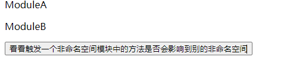
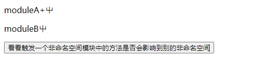

# vue-03

## 状态管理 vuex

### Vuex 工作流程

- State： 用于存储应用状态（state）
- Action： 用于执行异步操作（dispatch）
- Mutations： 用于修改state中的应用状态（commit）
- Getter： Vue中的计算属性（store.getters)
- Module： 模块，用于对状态进行拆分

在组件中开发者可以调用`dispatch`方法触发`action`执行异步操作 当异步操作执行完成之后 在`action`中可以继续调用`commit`方法触发`mutation`修改状态 当状态被修改之后视图更新


### Vuex下载
Vuex目前一共有两个版本 一个是`3.6.2`,另一个是`4.0.2` 3.x版本是提供给Vue2使用的 4.X是提供给Vue3使用的
在下载Vue的时如果不加版本号，默认下载3.X的版本 而我们要使用的是4.X版本 所以一定要记得加**版本号**

### 创建挂载 store
`store/index.js`
```js
import { createStore } from "vuex";

export default createStore({
  state: {},
  mutations: {},
  actions: {},
  getters: {},
  modules: {},
});

```

`main.js`
```js
import { createApp } from "vue";
import App from "./App.vue";
import router from "./router";
import store from "./store";

createApp(App).use(store).use(router).mount("#app");

```

### 使用Vuex
`store/index.js`
```js
import { createStore } from "vuex";

export default createStore({
  // 状态属性
  state: {
    name: "康康",
    aaa: 12321,
  },
  //  修改状态属性
  mutations: {
    updateNames(state, payload) {
      state.name = payload;
    },
  },
  // 异步操作
  actions: {
    updateName(ctx) {
      setTimeout(() => {
        ctx.commit("updateNames", "康某");
      }, 2000);
    },
  },
  // 计算属性
  getters: {
    newNames(state) {
      return state.name + "kangkang";
    },
  },
  modules: {},
});
```
`components/01.useVuex/index.vue`
```vue
<template>
  <div class="index">
    <!-- 使用Vuex——State  -->
    <h1>{{ $store.state.name }}</h1>
    <h1>{{ $store.state.aaa }}</h1>

    <!--  使用Vuex——getters  -->
    <h1>{{ $store.getters.newNames }}</h1>
    <!--    使用Vuex——mutations-->
    <button @click="handle1">把state.name替换为kangkang</button>
    <!--    使用Vuex——actions-->
    <button @click="handle2">把state.name替换为康某</button>
  </div>
</template>

<script>
import { useStore } from "vuex";
export default {
  setup() {
    const store = useStore();
    // 使用Vuex——State
    console.log(store.state.name);
    console.log(store.state.aaa);

    //  使用Vuex——getters
    console.log(store.getters.newNames);

    //  使用Vuex——mutations
    const handle1 = () => {
      store.commit("updateNames", "kangkang");
    };
    //  使用Vuex——aciotns
    const handle2 = () => {
      store.dispatch("updateName");
    };
    return {
      handle1,
      handle2,
    };
  },
};
</script>
```

#### module
- Vuex允许开发人员通过模块对状态进行拆分 允许开发人员将不同的功能拆分到不同的功能中
- 模块分为两种 一种是不具备命名空间的模块 另一种是具有命名空间的模块 推荐使用命名空间模块 因为其更加独立

1. 非命名空间模块
`store/moduleA`
```js
const moduleA = {
  state() {
    return {
      name: "ModuleA",
    };
  },
};
export default moduleA;
```
`store/moduleB`
```js
const moduleB = {
    state() {
        return {
            name: "ModuleB",
        };
    },
};
export default moduleB;
```

`store/index.js`
```js
import { createStore } from "vuex";
import moduleA from "@/store/ModuleA";
import moduleB from "@/store/moduleB";

export default createStore({
    //Vuex 模块化
    modules: {
        moduleA: moduleA,
        moduleB: moduleB,
    },
});
```

页面中的调用
`components/01.useVuex/index.vue`
```vue
<template>
  <div class="index">
    <p>{{ $store.state.moduleA.name }}</p>
    <p>{{ $store.state.moduleB.name }}</p>
  </div>
</template>
```
非命名空间模块中的mutations方法 当触发了其中一个mutations中的方法，所有定义了同名称的方法模块都会触发
`store/ModuleA.js`
```js
const moduleA = {
  state() {
    return {
      name: "ModuleA",
    };
  },
  mutations: {
    updateNames(state) {
      state.name = "moduleA+屮";
    },
  },
};
export default moduleA;
```

`store/moduleB.js`
```js
const moduleB = {
  state() {
    return {
      name: "ModuleB",
    };
  },
  mutations: {
    updateNames(state) {
      state.name = "moduleB屮";
    },
  },
};
export default moduleB;
```
`components/01.useVuex/index`
```vue
<template>
  <div class="index">
    <!--    使用Vuex——modules模块化获取数据-->
    <p>{{ $store.state.moduleA.name }}</p>
    <p>{{ $store.state.moduleB.name }}</p>
    <button @click="handle3">
      看看触发一个非命名空间模块中的方法是否会影响到别的非命名空间
    </button>
  </div>
</template>

<script>
import { useStore } from "vuex";
export default {
  setup() {
    const store = useStore();
    console.log(store.state.moduleA.name);
    console.log(store.state.moduleB.name);
    const handle3 = () => {
      store.commit("updateNames");
    };
    return {
      handle3,
    };
  },
};
</script>
```

甚至也会影响到主模块的同名mutations方法
`方法触发之前`



`updataNames方法触发之后`




且getter如果早两个非命名空间中定义了同一个名称 就会在使用中报错

2. 命名空间模块
`store/nameSpaceA`
```js
const nameSpaceA = {
  namespaced: true,
  state() {
    return {
      name: "nameSpaceA1",
    };
  },
  mutations: {
    updateNames(state) {
      state.name = "nameSpaceA1+++++";
    },
  },
};

export default nameSpaceA;
```

`store/nameSpaceB`
```js
const nameSpaceB = {
  namespaced: true,
  state() {
    return {
      name: "nameSpaceB2",
    };
  },
  mutations: {
    updateNames(state) {
      state.name = "nameSpaceB----";
    },
  },
};
export default nameSpaceB;
```

`store/index.js`
```js
import { createStore } from "vuex";
import moduleA from "@/store/ModuleA";
import moduleB from "@/store/moduleB";
import nameSpaceA from "@/store/nameSpaceA";
import nameSpaceB from "@/store/nameSpaceB";

export default createStore({
  // 状态属性
  state: {
    name: "康康",
    aaa: 12321,
  },
  //  修改状态属性
  mutations: {
    updateNames(state, payload) {
      state.name = payload;
    },
  },
  // 异步操作
  actions: {
    updateName(ctx) {
      setTimeout(() => {
        ctx.commit("updateNames", "康某");
      }, 2000);
    },
  },
  // 计算属性
  getters: {
    newNames(state) {
      return state.name + "kangkang";
    },
  },
  //Vuex 模块化
  modules: {
    nameSpaceA: nameSpaceA,
    nameSpaceB: nameSpaceB,
  },
});
```

`components/01.useVuex/index.vue`
```vue
<template>
  <div class="index">
    <p>命名空间</p>
    <p>{{ $store.state.nameSpaceA.name }}</p>
    <p>{{ $store.state.nameSpaceB.name }}</p>
    <button @click="handle4">修改nameSpaceA的名字</button>
    <button @click="handle5">修改nameSpaceB的名字</button>
  </div>
</template>

<script>
import { useStore } from "vuex";
export default {
  setup() {
    const store = useStore();
    //  使用Vuex——modules 命名模块
    console.log(store.state.nameSpaceA);
    console.log(store.state.nameSpaceB);
    console.log(store);
    const handle4 = () => {
      store.commit("nameSpaceA/updateNames");
    };
    const handle5 = () => {
      store.commit("nameSpaceB/updateNames");
    };
    return {
      handle4,
      handle5,
    };
  },
};
</script>
```

## 双向数据绑定

### 表单元素双向数据绑定
1. 什么是双向数据绑定
双向指视图（template）和逻辑（script） 双向数据绑定是指视图更新数据后自动同步到逻辑 逻辑更新数据后自动同步到视图
2. 实现表单的双向数据绑定
`components/02.twoWayBinding/InputBinding.vue`
```vue
<template>
  <div class="inputBinding">
    <h1>表单双向数据绑定</h1>
    <!--  
      @update:modelValue自定义事件 当数据更新时键最新的指返回，@update:moduleValue是固定格式不变的
      传递参数时，将$event放在最后面 参数房前前面
      由此属性实现数据双向数据绑定的监听 同样的也可以使用 onUpdated watch computed 方法进行数据的监听
    -->
    <input
        type="text"
        v-model="username"
        @update:modelValue="onUsernameChange('a', $event)"
    />
    <!-- 点击按钮让username变化 --->
    <button @click="handle">点击按钮让username变化</button>
  </div>
</template>

<script>
import { ref } from "vue";
export default {
  setup() {
    const username = ref("张三");
    const handle = () => {
      username.value = "kangkang";
    };
    const onUsernameChange = (arg, date) => {
      console.log("onUsernameChange");
      console.log(arg);
      console.log(date);
    };
    return {
      username,
      handle,
      onUsernameChange,
    };
  },
};
</script>
```


### 组件双向数据绑定

1. 普通版
父子组件数据相传
2. 升级版
   1. `ComBindingRegular`组件通过v-model传递`firstName`给组件`TestTemplate`   `ComBindingRegular`组件定义`handle`方法修改`firstName` 让`TestTemplate`中的props响应数据变化

`components/02.twoWayBingding/ComBindingRegular.vue` 

```vue
<template>
  <div class="ComBinding">
    <TestTemplate v-model="firstName"></TestTemplate>
    <button @click="handle">我是ComBindingRegular组件中的Button</button>
  </div>
</template>

<script>
import { ref } from "vue";
import TestTemplate from "@/components/02.twoWayBinding/TestTemplate";

export default {
  components: {
    TestTemplate,
  },
  setup() {
    const firstName = ref("康康");
    const handle = () => {
      firstName.value = "kangkang";
    };
    return {
      firstName,
      handle,
    };
  },
};
</script>
```
      2. `TestTemplate`组件通过`props: ["modelValue"]`接收数据,定义方法使用emit触发数据修改数据`components/02.twoWayBingding/ComBindingRegular.vue`
```vue
<template>
  <div class="testtemplate">
    <h1>{{ modelValue }}</h1>
    <button @click="handleClick">我是TestTemplate组件的button</button>
  </div>
</template>

<script>
export default {
  props: ["modelValue"],
  setup(props, { emit }) {
    const handleClick = () => {
      emit("update:modelValue", "康某人");
    };
    return {
      handleClick,
    };
  },
};
</script>
```

3. 终极版
> 传入多个v-model 使用 emit("update:firstName", 参数)

`components/02.twoWayBinding/ComBindingFinal`
```vue
<template>
  <div class="combindingfinal">
    <FinalTest
      v-model:firstName="firstName"
      v-model:last-name="lastName"
    ></FinalTest>
    <button @click="handle">我是ComBindingFinal组件中的Button</button>
  </div>
</template>

<script>
import { ref } from "vue";
import FinalTest from "@/components/02.twoWayBinding/FinalTest";

export default {
  components: {
    FinalTest,
  },
  setup() {
    const firstName = ref("康康");
    const lastName = ref("springLong");
    const handle = () => {
      firstName.value = "kangkang";
      lastName.value = "Spring_Long";
    };
    return {
      firstName,
      lastName,
      handle,
    };
  },
};
</script>
```

`components/02.twoWayBinding/FinalTest.vue`
```vue
<template>
  <div class="finaltest">
    <h1>{{ firstName }}</h1>
    <h1>{{ lastName }}</h1>
    <button @click="handleClick">我是FinalTest组件的button</button>
  </div>
</template>

<script>
export default {
  props: ["firstName", "lastName"],
  setup(props, { emit }) {
    const handleClick = () => {
      emit("update:firstName", "康某人");
      emit("update:lastName", "SPRING_LONG");
    };
    return {
      handleClick,
    };
  },
};
</script>
```

## customRef 防抖
1. 监听用户的连续操作 最终只响应连续操作的最后一次
当调用了`debounce`方法后代码不会重复声明`timer`变量 只会执行返回的函数 当用户点击就会触发清除定时器的方法,直至用户的最后一次点击
`components/03.customRef/useCustomRef.vue`
```vue
<template>
  <div class="customRef">
    <h1>防抖操作——只响应用户连续操作的最后一次</h1>
    <button @click="handle">按钮</button>
  </div>
</template>

<script>
export default {
  setup() {
    const handle = debounce(() => {
      console.log("点击了");
    }, 400);
    return {
      handle,
    };
  },
};

/**
 * 用于防抖的函数
 * @param handler 事件处理函数体
 * @param delay 防抖频率市场
 */
function debounce(handler, delay) {
  let timer = null;
  return function () {
    clearTimeout(timer);
    timer = setTimeout(() => {
      handler.call(this, arguments);
    }, delay);
  };
}
</script>
```

2. 创建具有自定义行为的响应式数据 通过拦截响应式数据的读取和设置实现
需求: 创建具有防抖功能的响应式数据。监听对响应式数据的连续更改, 只响应最后一次更改。

`components/03.customRef/useCustomRefDate.vue`
```vue
<template>
  <input type="text" v-model="keyword" />
  {{ keyword }}
</template>
<script>
import { customRef } from "vue";
export default {
  name: "App",
  setup() {
    const keyword = useDebounceRef("Hello", 400);
    return { keyword };
  },
};

function useDebounceRef(initialValue, delay) {
  let timer = null;
  return customRef((track, trigger) => {
    return {
      get() {
        // 跟踪 initialValue 值的变量
        track();
        return initialValue;
      },
      set(newValue) {
        clearTimeout(timer);
        timer = setTimeout(() => {
          initialValue = newValue;
          // 触发视图更新
          trigger();
        }, delay);
      },
    };
  });
}
</script>
```


## 代理对象 
1. 什么是数据响应式？
数据驱动视图，即数据和视图相互绑定 当数据发生变化后 视图自动更新
2. 如何实现数据响应式
实现数据响应式的核心在于禁停数据的变化 当数据发生变化后 执行视图更新操作
Vue3使用代理对象简体拿数据变化
创建对象的代理对象从而实现对对象的拦截和定义

- 对Proxy 的简单了解
`components/04.proxyObject/demo.html`
```html
<!doctype html>
<html lang="en">
<head>
    <meta charset="UTF-8">
    <meta name="viewport"
          content="width=device-width, user-scalable=no, initial-scale=1.0, maximum-scale=1.0, minimum-scale=1.0">
    <meta http-equiv="X-UA-Compatible" content="ie=edge">
    <title>Document</title>
</head>
<body>
<script>
    let person = { name: "kangkang", age: 20}
    // 第一个参数 是要代理的对象 第二个是回调函数 一定要有，如果没有操作一定要传入一个空对象
    // 对 p 对象进行的所有操作都会映射到 person 对象
    const p = new Proxy(person, {})
    console.log(p)  // Proxy { name: "张三", age: 20 }
    p.name = "康康"
//    输出数据源对象中的name
    console.log(person.name) // 康康
//    删除代理对象中的属性
    delete p.age
    console.log(person)
//    增加代理对象中的属性
    p.sex = "🚹"
    console.log(person)
</script>
</body>
</html>
```

- Proxy 深层代理对象
`components/04.proxyObject/demo2.html`
```html
<!doctype html>
<html lang="en">
<head>
    <meta charset="UTF-8">
    <meta name="viewport"
          content="width=device-width, user-scalable=no, initial-scale=1.0, maximum-scale=1.0, minimum-scale=1.0">
    <meta http-equiv="X-UA-Compatible" content="ie=edge">
    <title>Document</title>
</head>
<body>
  <script>
    //  数据源
    let person = {
      name: "kangkang",
      age: 20,
      brandList: {
        group: {title: "宝马"}
      }
    }

    // p对象 对person对象的代理对象
    // 对 p对象 进行的所有操作都会映射到代理person对象上
    const p = new Proxy(person, {
      //  获取对象属性
      get(target,property) {
        console.log("拦截了获取操作");
        return target[property];
      },
      // 设置对象属性
      set(target, property, value ) {
        console.log("拦截到了设置或新增操作");
        target[property] = value;
      },
      //  删除属性操作
      deleteProperty(target, property) {
        console.log("拦截到了删除属性操作");
        return delete target[property];
      }
    })
    // 拦截了获取操作
    console.log(p.name);// kangkang
    p.name = "康康";// 拦截到了设置或新增操作
    delete p.name// 拦截到了删除属性操作
    console.log(person)
  </script>
</body>
</html>
```

- proxy 代理的是整个对象无论层级有多深 都可以进行拦截